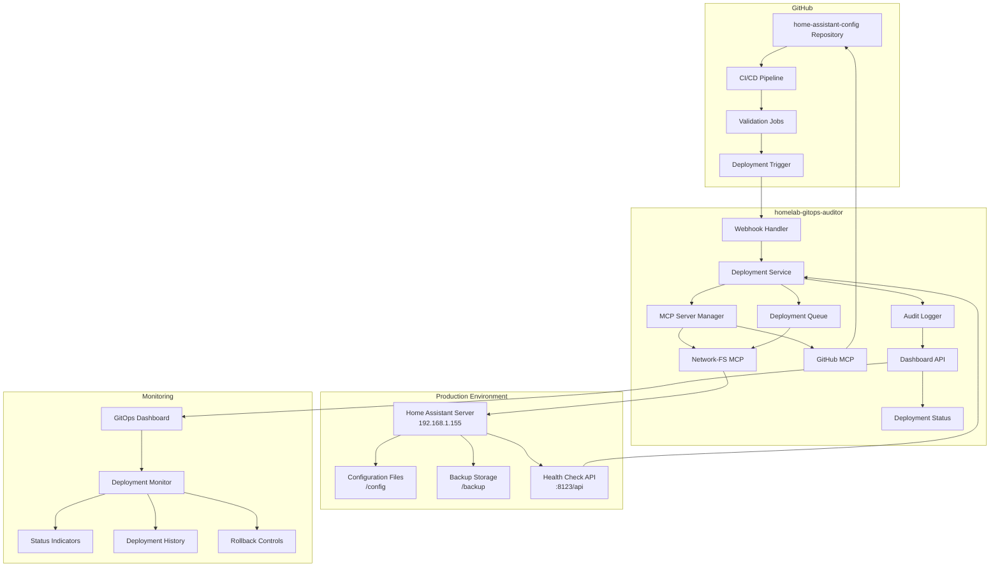

# Deployment Architecture: Home Assistant Config Automated Deployment

## System Architecture Overview



## Component Details

### 1. GitHub Integration Layer

#### 1.1 Repository Webhook
- **Purpose**: Trigger deployment events from home-assistant-config repository
- **Events**: Push to main branch, repository dispatch
- **Security**: Webhook signature verification
- **Payload**: Repository metadata, commit information, author details

#### 1.2 CI/CD Pipeline Integration
- **Validation Stage**: YAML lint, Home Assistant config check
- **Deployment Stage**: Repository dispatch to homelab-gitops-auditor
- **Status Reporting**: Deployment status updates back to GitHub

### 2. homelab-gitops-auditor Core Components

#### 2.1 Webhook Handler (`api/routes/webhooks.js`)
```javascript
// Processes GitHub webhook events
// - Validates webhook signatures
// - Extracts deployment parameters
// - Queues deployment requests
// - Returns immediate acknowledgment
```

**Key Features**:
- Signature validation for security
- Event filtering and processing
- Asynchronous deployment queuing
- Error handling and logging

#### 2.2 Deployment Service (`scripts/services/home-assistant-deployer.js`)
```javascript
// Core deployment orchestration service
// - Manages deployment queue
// - Coordinates MCP server operations
// - Handles deployment lifecycle
// - Provides status updates
```

**Key Features**:
- Queue-based deployment processing
- MCP server coordination
- Deployment state management
- Health check integration
- Rollback capability

#### 2.3 MCP Server Manager
```javascript
// Manages MCP server connections and operations
// - Network-FS MCP for file operations
// - GitHub MCP for repository operations
// - Connection pooling and error handling
// - Operation logging and monitoring
```

**Responsibilities**:
- MCP server lifecycle management
- Operation delegation and coordination
- Error handling and retry logic
- Performance monitoring

### 3. Production Environment Integration

#### 3.1 Home Assistant Server (192.168.1.155)
- **Configuration Path**: `/config`
- **Backup Path**: `/backup`
- **API Endpoint**: `:8123/api/`
- **Health Check**: `/api/states`

#### 3.2 File System Operations
```bash
# Network-FS MCP operations
# - Secure file transfer
# - Backup creation
# - Configuration validation
# - Permission management
```

#### 3.3 Health Check Integration
```javascript
// Pre and post deployment health checks
// - API connectivity verification
// - Configuration syntax validation
// - Service availability checks
// - Performance baseline monitoring
```

### 4. Monitoring and Control Interface

#### 4.1 Dashboard Integration
- **Deployment Status**: Real-time deployment progress
- **History View**: Deployment log and history
- **Control Interface**: Manual deployment and rollback
- **Notifications**: Deployment alerts and status updates

#### 4.2 API Endpoints
```javascript
// RESTful API for deployment operations
GET    /api/deployments/home-assistant-config/status
POST   /api/deployments/home-assistant-config/deploy
POST   /api/deployments/home-assistant-config/rollback
GET    /api/deployments/home-assistant-config/history
GET    /api/deployments/home-assistant-config/logs
```

## Data Flow Architecture

### 1. Deployment Trigger Flow
```
GitHub Push → CI/CD Validation → Repository Dispatch → Webhook Handler → Deployment Queue → MCP Operations → Production Deployment
```

### 2. Status Update Flow
```
Deployment Service → Status API → Dashboard → Real-time Updates → User Notifications
```

### 3. Rollback Flow
```
Rollback Trigger → Backup Validation → MCP Operations → Configuration Restore → Health Check → Status Update
```

## Security Architecture

### 1. Authentication and Authorization
- **GitHub Webhooks**: Signature-based authentication
- **API Access**: Token-based authentication
- **MCP Operations**: Secure channel encryption
- **Dashboard Access**: Role-based access control

### 2. Network Security
- **Internal Network**: 192.168.1.0/24 network isolation
- **Encrypted Communications**: TLS for all external communications
- **Firewall Rules**: Restricted port access
- **VPN Access**: Secure remote access for management

### 3. Data Protection
- **Configuration Backup**: Encrypted backup storage
- **Audit Logging**: Comprehensive operation logging
- **Access Control**: Principle of least privilege
- **Secrets Management**: Secure credential storage

## Scalability Considerations

### 1. Horizontal Scaling
- **Queue-based Processing**: Supports multiple deployment workers
- **Load Balancing**: API endpoint load distribution
- **Database Scaling**: Audit log database optimization
- **Cache Layer**: Deployment status caching

### 2. Performance Optimization
- **Asynchronous Operations**: Non-blocking deployment processing
- **Connection Pooling**: MCP server connection optimization
- **Caching Strategy**: Status and configuration caching
- **Batch Operations**: Efficient file system operations

### 3. Resource Management
- **Memory Usage**: Deployment queue size management
- **CPU Utilization**: Deployment worker optimization
- **Network Bandwidth**: Efficient file transfer protocols
- **Storage Management**: Backup retention and cleanup

## Disaster Recovery

### 1. Backup Strategy
- **Configuration Backup**: Pre-deployment configuration snapshots
- **Database Backup**: Audit log and status database backup
- **System Backup**: Complete system state backup
- **Offsite Storage**: Secure offsite backup storage

### 2. Recovery Procedures
- **Automatic Rollback**: Immediate rollback on deployment failure
- **Manual Recovery**: Step-by-step recovery procedures
- **Configuration Restore**: Point-in-time configuration restoration
- **Service Recovery**: Home Assistant service restoration

### 3. Monitoring and Alerting
- **Health Monitoring**: Continuous system health monitoring
- **Alert System**: Immediate notification on failures
- **Performance Monitoring**: Deployment performance tracking
- **Audit Compliance**: Comprehensive audit trail maintenance

## Integration Points

### 1. Existing homelab-gitops-auditor Components
- **Audit Infrastructure**: Deployment audit integration
- **Dashboard Framework**: Deployment monitoring integration
- **API Framework**: Deployment API integration
- **Configuration Management**: Deployment configuration integration

### 2. External System Integration
- **GitHub Integration**: Repository and CI/CD integration
- **Home Assistant Integration**: Production system integration
- **Monitoring Systems**: External monitoring integration
- **Notification Systems**: Alert and notification integration

### 3. MCP Server Integration
- **Network-FS MCP**: File system operation integration
- **GitHub MCP**: Repository operation integration
- **Future MCP Servers**: Extensible MCP integration framework
- **Custom MCP Servers**: Home Assistant specific MCP integration