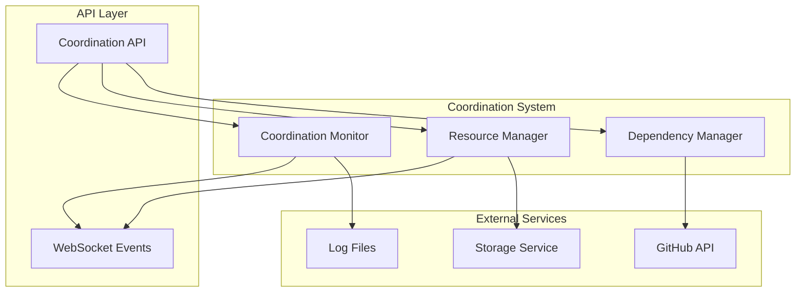

# Cross-Repository Coordination System

## Overview

The Cross-Repository Coordination System provides comprehensive management of dependencies, shared resources, and coordinated operations across multiple repositories in the homelab GitOps auditor. This system ensures proper deployment order, prevents resource conflicts, and maintains consistency across distributed services.

## Architecture



## Core Components

### 1. Repository Dependency Manager (`dependencyManager.js`)

Analyzes and manages dependencies across multiple repositories.

**Key Features:**
- Docker Compose dependency extraction
- Kubernetes manifest analysis
- Configuration dependency tracking
- Circular dependency detection
- Deployment order calculation
- Transitive dependency analysis

**Usage:**
```javascript
const dependencyManager = new RepositoryDependencyManager(services);

// Analyze dependencies
const analysis = await dependencyManager.analyzeDependencies(['repo1', 'repo2', 'repo3']);

// Coordinate deployment
const coordination = await dependencyManager.coordinateDeployment(repositories, {
  allowParallel: true,
  ignoreConflicts: false
});
```

### 2. Shared Resource Manager (`sharedResourceManager.js`)

Manages shared resources and resolves conflicts across repositories.

**Key Features:**
- Resource registration and claiming
- Conflict detection and resolution
- Configuration coordination
- Resolution strategy generation
- Resource locking mechanisms

**Usage:**
```javascript
const resourceManager = new SharedResourceManager(storage);

// Register a shared resource
const resourceId = await resourceManager.registerSharedResource({
  type: 'port',
  identifier: '8080',
  capacity: 1
});

// Claim resource
const claimId = await resourceManager.claimResource(resourceId, 'repo1', {
  type: 'deploy',
  exclusive: false
});

// Coordinate configurations
const coordination = await resourceManager.coordinateSharedConfiguration(['repo1', 'repo2']);
```

### 3. Coordination Monitor (`monitoring.js`)

Provides comprehensive monitoring, logging, and alerting for coordination operations.

**Key Features:**
- Operation tracking and metrics
- Real-time alerting
- Performance monitoring
- Conflict history tracking
- Health status reporting
- Prometheus metrics export

**Usage:**
```javascript
const monitor = new CoordinationMonitor({
  logLevel: 'info',
  logFile: 'logs/coordination.log',
  alertThresholds: {
    conflictRate: 0.3,
    avgResolutionTime: 300000,
    failureRate: 0.1
  }
});

// Track operations
const operationId = monitor.trackDependencyAnalysis('op123', ['repo1', 'repo2']);
monitor.completeDependencyAnalysis(operationId, { success: true });

// Get metrics
const metrics = monitor.collectMetrics();
const health = monitor.getHealthStatus();
```

## API Endpoints

### Dependency Analysis

#### `GET /api/coordination/dependencies`
Analyze dependencies across repositories.

**Parameters:**
- `repositories` (string): Comma-separated list of repositories
- `includeTransitive` (boolean): Include transitive dependencies

**Response:**
```json
{
  "repositories": ["repo1", "repo2"],
  "directDependencies": { ... },
  "transitiveDependencies": { ... },
  "circularDependencies": [],
  "deploymentOrder": ["repo1", "repo2"],
  "metadata": { ... }
}
```

#### `POST /api/coordination/coordinate-deployment`
Plan and coordinate deployment across repositories.

**Request:**
```json
{
  "repositories": ["repo1", "repo2", "repo3"],
  "options": {
    "allowParallel": true,
    "ignoreConflicts": false,
    "timeout": 3600
  }
}
```

**Response:**
```json
{
  "coordination": {
    "id": "coord_123",
    "status": "ready",
    "phases": [
      {
        "phase": 1,
        "repositories": ["repo1"],
        "parallel": false,
        "estimatedDuration": 45
      }
    ]
  },
  "deployment": {
    "totalPhases": 3,
    "parallelizable": 2,
    "estimatedDuration": 180
  }
}
```

### Resource Management

#### `GET /api/coordination/resource-conflicts`
Check for resource conflicts across repositories.

**Parameters:**
- `repositories` (string): Comma-separated list of repositories

#### `POST /api/coordination/resolve-conflicts`
Apply resolution strategies to conflicts.

**Request:**
```json
{
  "conflicts": [
    {
      "id": "conflict1",
      "type": "nginx-domain"
    }
  ],
  "resolutionStrategy": "subdomain-separation",
  "dryRun": false
}
```

### Monitoring and Metrics

#### `GET /api/coordination/metrics`
Get comprehensive coordination metrics.

**Parameters:**
- `format` (string): "json" or "prometheus"
- `timeRange` (number): Hours of data to include

#### `GET /api/coordination/alerts`
Get recent alerts and their status.

**Parameters:**
- `hours` (number): Time range for alerts
- `severity` (string): Filter by severity level
- `acknowledged` (boolean): Filter by acknowledgment status

#### `GET /api/coordination/health/detailed`
Get detailed health status with diagnostics.

## Configuration

### Dependency Analysis Configuration

```javascript
const dependencyConfig = {
  // File patterns to analyze
  dockerComposeFiles: ['docker-compose.yml', 'docker-compose.yaml'],
  kubernetesPath: ['k8s', 'kubernetes', 'manifests'],
  configFiles: ['.env', 'config.json', 'settings.yaml'],
  
  // Analysis options
  includeTransitive: true,
  detectCircular: true,
  maxDepth: 10
};
```

### Resource Management Configuration

```javascript
const resourceConfig = {
  // Resource types
  supportedTypes: ['port', 'domain', 'volume', 'network'],
  
  // Default capacities
  defaultCapacity: 1,
  maxCapacity: 100,
  
  // Lock settings
  defaultTTL: 1800, // 30 minutes
  maxTTL: 7200,     // 2 hours
  
  // Conflict resolution
  autoResolve: true,
  preferredStrategies: ['subdomain-separation', 'port-reassignment']
};
```

### Monitoring Configuration

```javascript
const monitoringConfig = {
  // Logging
  logLevel: 'info',
  logFile: 'logs/coordination.log',
  
  // Metrics collection
  metricsInterval: 60000, // 1 minute
  retentionDays: 30,
  
  // Alert thresholds
  alertThresholds: {
    conflictRate: 0.3,      // 30%
    avgResolutionTime: 300000, // 5 minutes
    failureRate: 0.1        // 10%
  }
};
```

## Conflict Resolution Strategies

### Nginx Domain Conflicts

1. **Subdomain Separation**
   - Creates unique subdomains for each repository
   - High confidence, automatic resolution
   - Example: `app.example.com`, `api.example.com`

2. **Path-Based Routing**
   - Uses path prefixes with shared domain
   - Medium confidence, automatic resolution
   - Example: `/app/*`, `/api/*`

3. **Port-Based Separation**
   - Assigns different ports to each service
   - Lower confidence, requires infrastructure changes

### Port Binding Conflicts

1. **Port Reassignment**
   - Assigns new ports to conflicting services
   - High confidence, automatic resolution
   - Preserves first service's port

2. **Service Consolidation**
   - Combines services behind a reverse proxy
   - Manual resolution, architectural change

### Environment Variable Conflicts

1. **Value Standardization**
   - Uses most common value across repositories
   - Medium confidence, automatic resolution

2. **Repository-Specific Overrides**
   - Creates per-repository override files
   - High confidence, manual setup required

## Monitoring and Alerting

### Key Metrics

- **Operation Metrics**: Success/failure rates, duration statistics
- **Conflict Metrics**: Frequency by type and severity
- **Resolution Metrics**: Strategy effectiveness, resolution times
- **Resource Metrics**: Usage patterns, claim durations
- **System Metrics**: Memory usage, active operations

### Alert Conditions

- **High Conflict Rate**: > 30% of operations result in conflicts
- **High Failure Rate**: > 10% of operations fail
- **Slow Resolution**: Average resolution time > 5 minutes
- **Resource Exhaustion**: Critical resources at capacity
- **System Degradation**: Memory or performance issues

### Health Checks

```bash
# Basic health check
curl -X GET /api/coordination/health

# Detailed diagnostics
curl -X GET /api/coordination/health/detailed

# Current metrics
curl -X GET /api/coordination/metrics

# Recent alerts
curl -X GET /api/coordination/alerts?hours=24
```

## Error Handling

The system provides comprehensive error handling with specific error types:

- **Validation Errors**: Invalid input parameters
- **Circular Dependency Errors**: Unresolvable dependency cycles
- **Resource Conflict Errors**: Conflicting resource usage
- **Resolution Errors**: Failed conflict resolution attempts
- **System Errors**: Internal service failures

## Performance Considerations

### Scalability

- Supports analysis of 100+ repositories
- Efficient caching of dependency graphs
- Parallel processing where possible
- Incremental analysis updates

### Optimization

- Repository-level caching
- Lazy loading of dependency data
- Configurable analysis depth
- Background cleanup processes

## Testing

Comprehensive test suite covers:

- Dependency analysis accuracy
- Conflict detection reliability
- Resolution strategy effectiveness
- API endpoint functionality
- Error handling scenarios
- Performance benchmarks

```bash
# Run coordination tests
npm test api/test/coordination.test.js

# Run with coverage
npm run test:coverage -- api/test/coordination.test.js
```

## Integration

### With Pipeline Orchestrator

```javascript
const { CoordinationService } = require('./services/coordination');

const coordination = new CoordinationService(services);

// Integrate with pipeline
pipeline.addPreDeploymentHook(async (repositories) => {
  const conflicts = await coordination.checkResourceConflicts(repositories);
  if (conflicts.length > 0) {
    throw new Error(`Resource conflicts detected: ${conflicts.map(c => c.resource).join(', ')}`);
  }
});
```

### With GitHub Integration

```javascript
// Auto-analyze dependencies on repository changes
githubWebhook.on('push', async (event) => {
  const repository = event.repository.name;
  await coordination.analyzeDependencies([repository]);
});
```

### With Monitoring Systems

```javascript
// Export metrics to Prometheus
app.get('/metrics', (req, res) => {
  const metrics = coordination.monitor.exportMetrics('prometheus');
  res.set('Content-Type', 'text/plain');
  res.send(metrics);
});
```

## Best Practices

1. **Dependency Management**
   - Keep dependency graphs shallow
   - Avoid circular dependencies
   - Document external dependencies

2. **Resource Allocation**
   - Use unique ports per environment
   - Implement proper resource cleanup
   - Monitor resource utilization

3. **Conflict Prevention**
   - Follow naming conventions
   - Use environment-specific configurations
   - Implement proper resource isolation

4. **Monitoring**
   - Set appropriate alert thresholds
   - Regular health check monitoring
   - Analyze resolution patterns

## Troubleshooting

### Common Issues

1. **Circular Dependencies**
   ```
   Error: Circular dependencies detected: repo1 -> repo2 -> repo1
   ```
   - Review service dependencies
   - Break circular references
   - Use dependency injection patterns

2. **Resource Conflicts**
   ```
   Error: Resource conflicts detected: port:8080
   ```
   - Check port assignments
   - Apply resolution strategies
   - Use environment-specific ports

3. **Resolution Failures**
   ```
   Error: Failed to apply resolution strategy
   ```
   - Verify file permissions
   - Check repository access
   - Review resolution strategy

### Debug Commands

```bash
# Check dependency analysis
curl -X GET '/api/coordination/dependencies?repositories=repo1,repo2'

# Check active operations
curl -X GET '/api/coordination/operations?status=active'

# View recent alerts
curl -X GET '/api/coordination/alerts?severity=high'

# Force cleanup
curl -X POST '/api/coordination/cleanup'
```

## Roadmap

### Planned Features

- [ ] Visual dependency graph generation
- [ ] Advanced conflict prediction
- [ ] Integration with external monitoring
- [ ] Automated rollback coordination
- [ ] Multi-environment support
- [ ] GitOps workflow integration

### Performance Improvements

- [ ] Distributed dependency analysis
- [ ] Real-time conflict detection
- [ ] Advanced caching strategies
- [ ] Parallel resolution processing

## Contributing

1. Follow existing code patterns
2. Add comprehensive tests
3. Update documentation
4. Consider performance impact
5. Test with multiple repositories

## License

This coordination system is part of the homelab-gitops-auditor project and follows the same licensing terms.