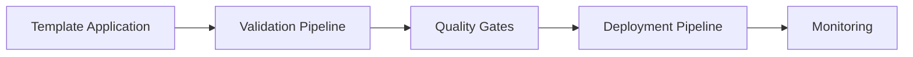
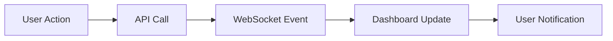
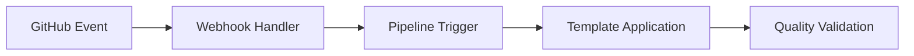

# Phase 2 Integration Checklist & Next Steps

## Executive Summary

This checklist provides a structured approach to integrating Phase 2 Enhanced Dashboard & Pipeline features with the existing Phase 1B Template Application Engine. The integration maintains backward compatibility while adding advanced real-time capabilities and automated workflows.

---

## Critical Integration Questions Answered

### 1. How does the template engine report progress?
**Current State**: CLI-based logging to stdout/stderr  
**Phase 2 Enhancement**: Real-time WebSocket events with structured progress data
- `template:application:progress` events with step-by-step updates
- Dashboard progress bars and status indicators
- Error handling with automatic rollback notifications

### 2. What events can trigger pipeline runs?
**Identified Triggers**:
- Template application completion (`template:application:completed`)
- GitHub webhook events (push, PR, release)
- Manual pipeline execution from dashboard
- Scheduled pipeline runs (cron-like triggers)
- Quality gate failures requiring remediation

### 3. How are template applications tracked?
**Current State**: File-based logging and backup metadata  
**Phase 2 Enhancement**: Database-backed tracking with:
- `template_applications` table for persistent storage
- Real-time status updates via WebSocket
- Dashboard visibility with filtering and search
- Historical analysis and reporting

### 4. What metrics are currently collected?
**Current Metrics**:
- Repository health status (clean, dirty, missing, extra)
- Template application success/failure rates
- Backup creation and validation status
- MCP server response times

**Phase 2 Additions**:
- Pipeline execution metrics
- Quality gate pass/fail rates
- Template compliance scores
- User interaction analytics

### 5. How can we extend the audit report structure?
**Extension Points**:
- Add `template_compliance` field to repository entries
- Include `pipeline_status` for active pipelines
- Add `quality_gates` results summary
- Include `last_template_applied` metadata

---

## Integration Checklist

## 🎯 Phase 2A: Foundation (Weeks 1-4)

### Database Integration
- [ ] **Setup PostgreSQL Database**
  - [ ] Install and configure PostgreSQL
  - [ ] Create database schema for templates, pipelines, executions
  - [ ] Implement database migration scripts
  - [ ] Add connection pooling and error handling
  - [ ] Create backup and recovery procedures

- [ ] **Migrate In-Memory Storage**
  - [ ] Convert `phase2-endpoints.js` storage to database queries
  - [ ] Implement data access layer (DAL) with proper ORM
  - [ ] Add database indexing for performance
  - [ ] Create data validation and constraints
  - [ ] Implement soft delete for audit trails

### Template Engine API Integration
- [ ] **Convert CLI Operations to API Endpoints**
  - [ ] `POST /api/v2/templates/apply` - Apply template with real-time updates
  - [ ] `GET /api/v2/templates` - List available templates
  - [ ] `POST /api/v2/templates/validate` - Validate template configuration
  - [ ] `GET /api/v2/templates/applications` - List template applications
  - [ ] `POST /api/v2/templates/rollback` - Rollback template application

- [ ] **WebSocket Event Integration**
  - [ ] Connect template applicator to WebSocket service
  - [ ] Implement progress tracking for long-running operations
  - [ ] Add error handling with automatic client notification
  - [ ] Create event logging for debugging and monitoring
  - [ ] Add client subscription management for targeted updates

### Pipeline Engine Foundation
- [ ] **Core Pipeline Execution**
  - [ ] Implement pipeline definition parser
  - [ ] Create step execution engine with error handling
  - [ ] Add pipeline status tracking and persistence
  - [ ] Implement pipeline cancellation and cleanup
  - [ ] Create pipeline execution logging system

- [ ] **Template-Pipeline Integration**
  - [ ] Connect template completion to pipeline triggers
  - [ ] Implement pipeline templates for common workflows
  - [ ] Add template metadata to pipeline context
  - [ ] Create pipeline generation from template definitions
  - [ ] Add template compliance checking in pipelines

## 🔧 Phase 2B: Integration (Weeks 5-8)

### GitHub Webhook Integration
- [ ] **Webhook Handler Enhancement**
  - [ ] Extend `webhook-handler.js` for pipeline triggers
  - [ ] Add signature validation and security measures
  - [ ] Implement event filtering and routing
  - [ ] Add webhook event logging and monitoring
  - [ ] Create webhook configuration management UI

- [ ] **Automated Workflow Integration**
  - [ ] Connect GitHub events to pipeline execution
  - [ ] Implement PR-based template validation
  - [ ] Add automated quality checks on push events
  - [ ] Create release pipelines for tag events
  - [ ] Add issue-based workflow triggers

### Dashboard Enhancement
- [ ] **Template Management UI**
  - [ ] Complete `TemplatesPage` with real API integration
  - [ ] Enhance `TemplateWizard` with validation and preview
  - [ ] Add template application history and status tracking
  - [ ] Implement template search and filtering
  - [ ] Create template compliance reporting

- [ ] **Pipeline Dashboard**
  - [ ] Complete `PipelineBuilder` with save/load functionality
  - [ ] Enhance `PipelineDesigner` with validation and testing
  - [ ] Add pipeline execution monitoring and logs
  - [ ] Implement pipeline scheduling and triggers
  - [ ] Create pipeline performance metrics

- [ ] **Real-time Updates**
  - [ ] Connect all dashboard components to WebSocket events
  - [ ] Implement optimistic UI updates with rollback
  - [ ] Add connection recovery and offline mode
  - [ ] Create push notifications for critical events
  - [ ] Add user preference management for notifications

### Quality Gates Integration
- [ ] **Code-linter MCP Integration**
  - [ ] Connect template validation to code-linter MCP
  - [ ] Implement pre-commit hooks via MCP coordination
  - [ ] Add automated quality checks in pipelines
  - [ ] Create quality metrics dashboard
  - [ ] Add quality gate configuration management

- [ ] **Compliance Tracking**
  - [ ] Implement template compliance scoring
  - [ ] Add repository compliance reporting
  - [ ] Create compliance trend analysis
  - [ ] Add automated compliance remediation
  - [ ] Implement compliance alerts and notifications

## 🚀 Phase 2C: Testing & Deployment (Weeks 9-10)

### End-to-End Testing
- [ ] **Integration Testing**
  - [ ] Test complete template-to-pipeline workflows
  - [ ] Validate WebSocket event delivery and handling
  - [ ] Test GitHub webhook to pipeline integration
  - [ ] Verify quality gate integration and reporting
  - [ ] Test database performance under load

- [ ] **User Acceptance Testing**
  - [ ] Test template discovery and application workflows
  - [ ] Validate pipeline creation and execution flows
  - [ ] Test real-time dashboard updates and notifications
  - [ ] Verify error handling and recovery procedures
  - [ ] Test mobile and tablet dashboard responsiveness

### Performance Optimization
- [ ] **Database Optimization**
  - [ ] Optimize database queries and indexing
  - [ ] Implement query result caching
  - [ ] Add database connection pooling
  - [ ] Monitor and optimize slow queries
  - [ ] Implement database monitoring and alerting

- [ ] **WebSocket Optimization**
  - [ ] Optimize WebSocket message batching
  - [ ] Implement client reconnection logic
  - [ ] Add message compression for large payloads
  - [ ] Monitor WebSocket connection health
  - [ ] Optimize memory usage for multiple connections

### Production Deployment
- [ ] **Infrastructure Setup**
  - [ ] Configure production database with backups
  - [ ] Setup reverse proxy with SSL termination
  - [ ] Configure monitoring and logging systems
  - [ ] Implement health checks and alerts
  - [ ] Setup automated deployment pipelines

- [ ] **Security Hardening**
  - [ ] Implement API authentication and authorization
  - [ ] Add input validation and sanitization
  - [ ] Configure CORS and security headers
  - [ ] Implement rate limiting and DDoS protection
  - [ ] Add security scanning and vulnerability management

---

## Key Integration Points Summary

### Template Engine → Pipeline Integration

**Integration Steps**:
1. Template application triggers validation pipeline
2. Quality gates validate template compliance
3. Successful validation triggers deployment pipeline
4. Monitoring tracks application health

### Dashboard → Real-time Updates

**Integration Flow**:
1. User initiates action (template apply, pipeline run)
2. API processes request and emits WebSocket events
3. Dashboard receives real-time updates
4. User sees progress and receives notifications

### GitHub → Pipeline Automation

**Automation Flow**:
1. GitHub webhook triggers pipeline
2. Pipeline applies templates or validates changes
3. Quality gates ensure compliance
4. Results reported back to GitHub

---

## Success Criteria Validation

### Technical Success Criteria
- [ ] **Performance Targets Met**
  - [ ] Template application < 30 seconds average
  - [ ] Pipeline execution < 5 minutes for standard workflows
  - [ ] WebSocket latency < 500ms
  - [ ] Database queries < 100ms (95th percentile)

- [ ] **Reliability Targets Met**
  - [ ] System availability > 99.5%
  - [ ] Template application success rate > 95%
  - [ ] Pipeline execution success rate > 90%
  - [ ] WebSocket connection uptime > 99%

### User Experience Success Criteria
- [ ] **Usability Targets Met**
  - [ ] Template discovery < 10 seconds
  - [ ] Pipeline creation < 2 minutes
  - [ ] Error resolution < 1 minute
  - [ ] Quality feedback < 30 seconds

- [ ] **Feature Completeness**
  - [ ] All Phase 1B features remain functional
  - [ ] Template management fully operational
  - [ ] Pipeline builder and execution working
  - [ ] Real-time updates reliable and accurate

---

## Risk Mitigation Strategies

### Technical Risks
- **Database Migration Issues**
  - *Mitigation*: Implement parallel data systems during transition
  - *Rollback*: Maintain file-based storage as fallback

- **WebSocket Connection Stability**
  - *Mitigation*: Implement automatic reconnection and fallback polling
  - *Monitoring*: Real-time connection health monitoring

- **Pipeline Execution Failures**
  - *Mitigation*: Implement robust error handling and retry mechanisms
  - *Recovery*: Automatic rollback and notification systems

### Integration Risks
- **Phase 1B Compatibility**
  - *Mitigation*: Comprehensive regression testing
  - *Validation*: Maintain existing API contracts

- **MCP Server Dependencies**
  - *Mitigation*: Implement fallback mechanisms for MCP failures
  - *Monitoring*: Health checks for all MCP server connections

---

## Next Immediate Actions

### Week 1 Priorities
1. **Database Setup** - Configure PostgreSQL and create initial schema
2. **API Foundation** - Begin converting template operations to REST endpoints
3. **WebSocket Enhancement** - Extend WebSocket service for template events
4. **Dashboard Updates** - Connect existing template components to real APIs

### Week 2 Priorities
1. **Pipeline Engine** - Implement basic pipeline execution framework
2. **GitHub Integration** - Enhance webhook handler for pipeline triggers
3. **Quality Gates** - Begin code-linter MCP integration
4. **Testing Framework** - Setup integration testing infrastructure

---

## Conclusion

The Phase 1B integration analysis reveals a solid foundation for Phase 2 enhancements. The template application engine provides excellent building blocks for pipeline automation, and the existing dashboard architecture supports the planned real-time enhancements.

Key success factors:
- Maintain backward compatibility with Phase 1B functionality
- Implement robust error handling and fallback mechanisms
- Ensure real-time updates are reliable and performant
- Create comprehensive testing coverage for all integration points

The outlined checklist provides a clear path forward for successful Phase 2 implementation while minimizing risks and ensuring a smooth user experience.

---

**Document Version**: 1.0  
**Created**: 2025-07-10  
**Phase**: 2A Implementation Ready  
**Status**: Integration Plan Approved